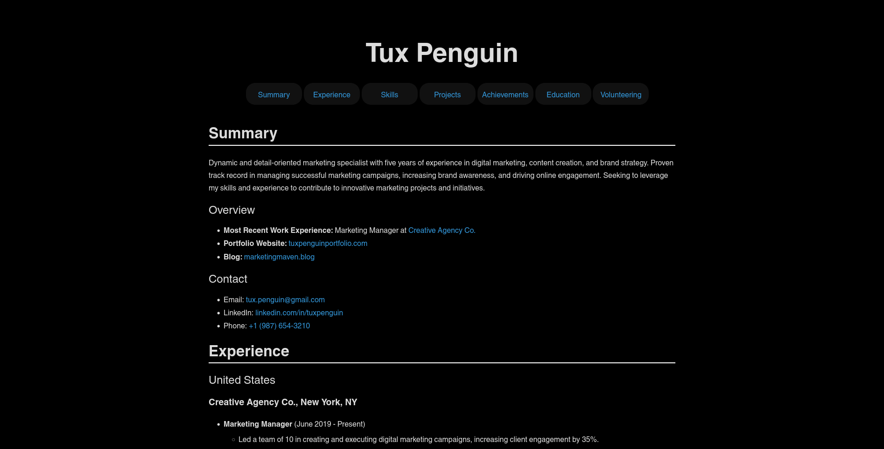
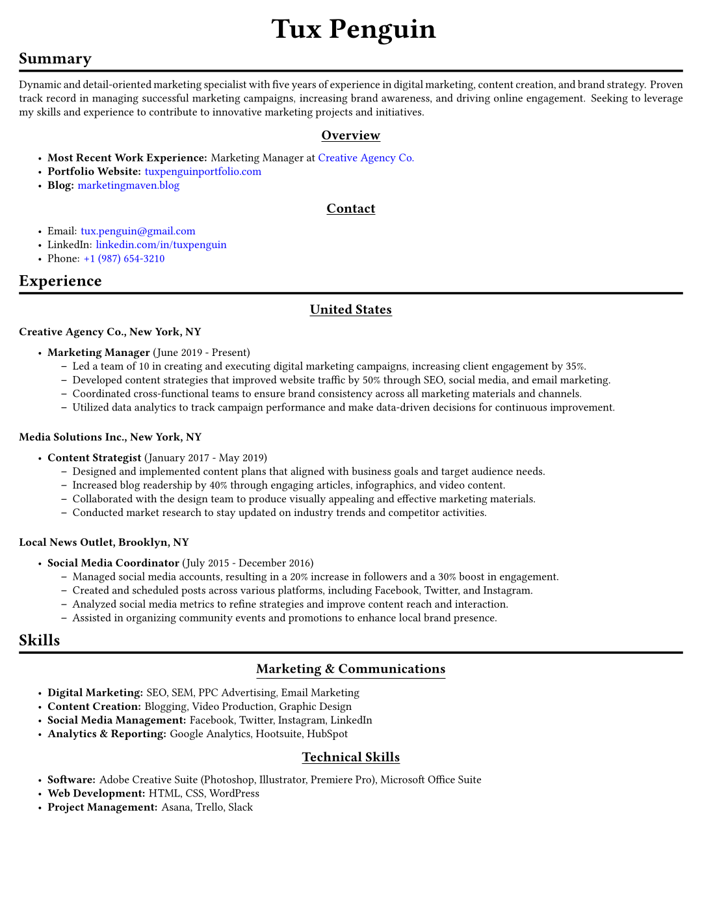

# Revival of an Old Markdown to Resume/CV Make Script

*Create your resume/CV easily using a single markdown file (`index.md`).*

**HTML Output Example**

**PDF Output Example**

A Makefile is provided so that you can compile it into both a LaTeX PDF and an HTML file using `pandoc`.

## Features

### HTML Output
- Responsive web design, custom background, and div settings with `style.css`.
- Automatically generated "table of contents" transformed into a menu bar with dropdown subsections.
- Longer content sections are hidden and revealed on mouseover (or with a single-tap on mobile).

### PDF Output
- Custom LaTeX template (`template.tex`) used for PDF generation.

## Usage
1. Edit the `index.md` with your editor of choice.
2. Run `make` (or `make compile`) to generate a PDF and HTML file.

## Dependencies
- `pandoc`
- `LaTeX`
- `make` (optional, commands in the `Makefile` can be run indivdually)

## Links
- [Original Public Archive](https://github.com/LukeSmithxyz/md-website-cv)
